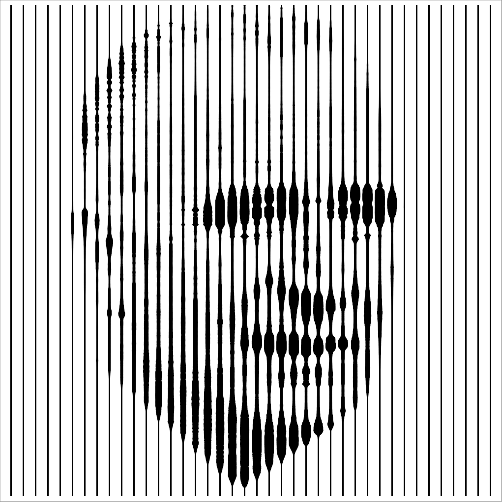

# vasarely

A standalone python to reproduce the style of Victor Vasarely in this artwork:


It is found in the entrance hall of the Centre Pompidou in Paris.  
(Hence the portrait of Georges Pompidou)

The code produces SVG images.

## Usage

Example : 
`python vasarely.py --file-in images/test_in.png --file-out images/test_out.svg --n-bands 40`

Input (any) | Output (SVG)
:---: | :---:
 | 


```
usage: vasarely.py [-h] --file-in FILE_IN [--file-out FILE_OUT]
                   [--n-bands N_BANDS] [--axis AXIS] [--min-thick MIN_THICK]
                   [--min-space MIN_SPACE] [--border BORDER]

optional arguments:
  -h, --help            show this help message and exit
  --file-in FILE_IN     Path of the input image.
  --file-out FILE_OUT   Path of the output SVG image. (default : input file
                        but it's SVG)
  --n-bands N_BANDS     Number of shadow bands to use. (default : 32)
  --axis AXIS           1 for vertical bands, 0 for horizontal bands (default
                        : 1).
  --min-thick MIN_THICK
                        Minimum thickness of a bright band, in px (default :
                        3.).
  --min-space MIN_SPACE
                        Minimum space between bright bands, in px (default :
                        3.).
  --border BORDER       Border size order around the results, in px (default :
                        10.).
```